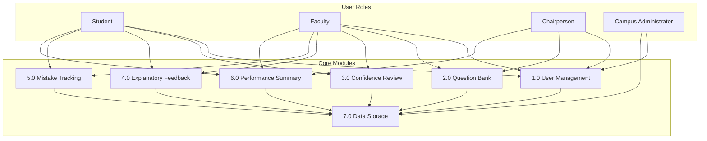

# ExamiQ Functional Testing

ExamiQ is a self-regulated mathematics exam review system for college students with dynamic feedback, mistake tracking, and confidence-based test flow. This document defines functional test cases and a functional testing checklist for manual verification and thesis appendix use.

**Related documentation:** [System Flow](system-flow.md) · [User Roles and Workflows](user-roles-and-workflows.md) · [DFD Diagrams](dfd/README.md)

---

## 1. Scope and references

### 1.1 System context

ExamiQ serves four user roles across seven functional modules:

| Module | Purpose |
|--------|---------|
| **1.0 User Management** | Registration, authentication, profiles, account approval |
| **2.0 Mathematics Question Bank** | Curriculum topics, question authoring, approval, distribution |
| **3.0 Confidence-Based Review** | Session setup, timed delivery, answer and confidence capture |
| **4.0 Explanatory Feedback** | Step-by-step explanations, AI tutor, feedback usage tracking |
| **5.0 Mistake Tracking** | Automatic mistake logging, error classification, pattern views |
| **6.0 Performance Summary & Review History** | Dashboards, session history, course and program analytics |
| **7.0 Data Storage** | Persistent storage for users, sessions, questions, feedback, mistakes, and analytics |

### 1.2 Roles and home URLs

| Role | Post-login home |
|------|-----------------|
| Student | `/student/dashboard/` |
| Faculty (Professor) | `/professor/courses/` |
| Chairperson | `/chairperson/dashboard/` |
| Campus Administrator | `/admin/` or `/campus/` |

### 1.3 Testing environment

| Item | Value |
|------|-------|
| Application | Django web app (`manage.py runserver`) |
| Database | SQLite (local dev) or PostgreSQL (production) |
| Test runner (automated reference) | `pytest` with fixtures in `conftest.py` |
| Auth URLs | `/accounts/login/`, `/accounts/signup/`, `/accounts/logout/` |
| Profile | `/profile/` |

**Prerequisites for end-to-end student review testing:**

1. Campus Administrator sets current academic year and term at `/campus/academic-calendar/`
2. Campus Administrator creates program sections at `/campus/sections/`
3. Chairperson creates teaching assignments at `/chairperson/assignments/`
4. Faculty enables exam setup at `/professor/courses/<course_pk>/exam-setup/`
5. Faculty creates questions at `/professor/courses/<course_pk>/questions/` (approved status required for live sessions)
6. Student completes profile (program, year level, section) at `/profile/`

### 1.4 S/U legend (Appendix B)

| Code | Meaning |
|------|---------|
| **S** | Satisfactory — function works as specified based on codebase review and existing automated tests |
| **U** | Unsatisfactory — function is documented but not fully implemented or not wired to the UI |

---

## Appendix A — Test Cases

Tables follow the format: **Action | Activities | System Response | Actual Errors | Response**

---

### A.1 Student

#### User Management

| Action | Activities | System Response | Actual Errors | Response |
|--------|------------|-----------------|---------------|----------|
| Sign In | Enter email and password; click Sign In | User authenticated; redirect to `/student/dashboard/` | Invalid email or password | Display error prompting user to enter valid credentials |
| Sign In | Enter credentials for deactivated account | — | Account inactive | Redirect to login; display inactive-account message |
| Sign Up | Enter First Name, Last Name, email, 9-digit student number, program, year level, section, phone, password, and confirm password; click Proceed to Sign Up | Account created with `approved` status; user signed in; redirect to student dashboard | Email already registered | Prompt user to enter a unique email address |
| Sign Up | Enter password that fails Django validators (e.g. too short, all numeric) | — | Password too weak | Prompt user to use a strong password |
| Sign Up | Leave student number blank or enter fewer than 9 digits | — | Invalid student number | Prompt: "Student number must be exactly 9 digits." |
| Sign Up | Select section that does not match program and year level | — | Section mismatch | Prompt: "Selected section does not match your program and year level." |
| Sign Up | Select section at maximum capacity | — | Section full | Prompt: "This section is full. Choose another section." |
| View Profile | Navigate to `/profile/`; update name or program/year/section | Profile saved; success message displayed | Section full or mismatch on update | Display validation error; changes not saved |
| Change Password | On profile page, enter current password and new password twice | Password updated; `password_changed_at` set | Wrong current password | Display password validation error |
| Log Out | Click Sign Out in navbar or sidebar | Session ended; redirect to `/accounts/login/` | No system errors | No additional response required |

#### Confidence-Based Review

| Action | Activities | System Response | Actual Errors | Response |
|--------|------------|-----------------|---------------|----------|
| Review Setup | Complete profile; navigate to `/student/review/setup/`; select subject, topic, difficulty, and duration | Setup wizard advances through subjects → topics → timing; preview shows question count | Profile incomplete (missing section or year level) | Display eligibility message; block session start |
| Review Setup | Attempt setup when no teaching assignment or exam setup exists for section | — | No offerings available | Display message that no review offerings are available |
| Start Review | Confirm setup; system creates session at `/student/review/<pk>/` | Timed session begins; first question loaded via HTMX | No approved active questions for selected topic | Display error or empty session message |
| Submit Answer | Select or enter answer within per-question time limit; submit | Answer graded; confidence inferred from response time; next question loaded | Time expired | Session marks question unanswered; advance or expire per timer rules |
| Submit Answer | Submit incorrect answer | Wrong answer recorded; mistake logged automatically | No system errors | Continue session; mistake available after session in Mistakes module |
| Session Summary | Complete or expire session; view `/student/review/<pk>/summary/` | Summary shows accuracy, calibration insights (mastery, misconception, lucky guess, expected gap), and recommendations | No system errors | Summary displayed even for partial sessions |

#### Explanatory Feedback

| Action | Activities | System Response | Actual Errors | Response |
|--------|------------|-----------------|---------------|----------|
| View Feedback | From session summary, open feedback for an answer at `/student/review/<pk>/feedback/<answer_id>/` | Step-by-step explanation displayed; view recorded | Feedback not yet generated for question | Prompt to generate feedback or show placeholder |
| Step Feedback | Open individual explanation step | Step content displayed; step view tracked | Invalid step ID | Return 404 |
| AI Tutor | Open tutor chat at `/student/review/<pk>/tutor/chat/`; send a message | AI response returned in chat history | AI provider unavailable or misconfigured | Display error message; chat history preserved |

#### Mistake Tracking

| Action | Activities | System Response | Actual Errors | Response |
|--------|------------|-----------------|---------------|----------|
| View Mistakes | Navigate to `/student/mistakes/` | List of mistake records from review sessions displayed | No mistakes yet | Show empty state |
| View Weak Areas | Navigate to `/student/mistakes/patterns/` | Topic-level mistake patterns displayed | No mistake data | Show empty state |
| Answer Detail | Open mistake at `/student/mistakes/answers/<answer_pk>/` | Question, student answer, correct answer, and explanation shown | Invalid answer ID | Return 404 |
| Generate AI Feedback | Click generate on mistake detail page | AI-generated mistake feedback stored and displayed | AI provider error | Display error; allow retry |

#### Performance Summary

| Action | Activities | System Response | Actual Errors | Response |
|--------|------------|-----------------|---------------|----------|
| View Dashboard | Navigate to `/student/dashboard/` | Performance summary, recent sessions, and progress metrics displayed | No session history | Show dashboard with zero-state metrics |
| Session History | Navigate to `/student/sessions/` | List of past review sessions with scores and dates | No sessions | Show empty state |
| Topic Progress | Navigate to `/student/topics/` | Per-topic mastery and progress displayed | No topic data | Show empty state |

---

### A.2 Faculty (Professor)

#### User Management

| Action | Activities | System Response | Actual Errors | Response |
|--------|------------|-----------------|---------------|----------|
| Sign Up | Enter email, employee ID, department (optional), phone, password; select Faculty role; submit | Account created as `pending` and inactive; redirect to login with pending banner | Employee ID missing | Prompt: "Employee ID is required." |
| Sign In | Enter credentials before campus approval | — | Account pending/inactive | Redirect to `/accounts/login/?registered=pending`; toast: account submitted for review |
| Sign In | Enter credentials after campus approval | User authenticated; redirect to `/professor/courses/` | Invalid credentials | Prompt to enter valid credentials |
| View Profile | Navigate to `/profile/`; update name or photo | Profile updated | Photo over 2 MB or invalid format | Prompt: "Photo must be 2 MB or smaller." or invalid type message |
| Log Out | Click Sign Out | Session ended; redirect to login | No system errors | No additional response required |

#### Question Bank

| Action | Activities | System Response | Actual Errors | Response |
|--------|------------|-----------------|---------------|----------|
| Manage Topics | Open `/professor/courses/<course_pk>/topics/`; create or edit topic | Topic saved under course program | Duplicate topic name | Display validation error |
| Create Question | Open `/professor/courses/<course_pk>/questions/create/`; enter stem, choices, correct answer, difficulty | Question saved with `pending` status | Missing required fields or invalid structure | Prompt to complete all required fields |
| Edit Question | Edit approved question at `.../questions/<question_pk>/edit/` | Question updated; status returns to `pending` | Question not owned by professor | Return 404 |
| Toggle Active | Deactivate question via toggle | Question removed from live pool (`is_active=False`) | Question not found | Return 404 |
| AI Generate | Use `/professor/courses/<course_pk>/questions/ai-generate/` with topic and count | Draft questions generated for review | AI provider error or invalid topic | Display error message |

#### Confidence-Based Review (Exam Configuration)

| Action | Activities | System Response | Actual Errors | Response |
|--------|------------|-----------------|---------------|----------|
| Exam Setup | Open `/professor/courses/<course_pk>/exam-setup/`; enable setup, set topics, difficulties, duration, per-question timer | Exam setup saved; students in section become eligible | Missing required configuration | Display validation errors |
| Review Windows | Create window at `/professor/courses/<course_pk>/windows/create/` with start and end dates | Review window saved | End date before start date | Display date validation error |
| Review Windows | Delete review window | Window removed | Window in use by active session | Allow delete or show constraint message per implementation |

#### Explanatory Feedback

| Action | Activities | System Response | Actual Errors | Response |
|--------|------------|-----------------|---------------|----------|
| Edit Feedback | Open `/professor/courses/<course_pk>/feedback/`; edit explanation steps for a question | Explanation steps saved | Question not in course | Return 404 |

#### Mistake Tracking and Performance Summary

| Action | Activities | System Response | Actual Errors | Response |
|--------|------------|-----------------|---------------|----------|
| Course Analytics | Open `/professor/courses/<course_pk>/` | Course performance summary, accuracy, and calibration data displayed | Course not owned | Return 404 |
| Roster | Open `/professor/courses/<course_pk>/roster/`; drill into student | Student list and individual performance shown | Student not in course roster | Return 404 |
| Intervention Export | Export interventions at `/professor/courses/<course_pk>/interventions/export/` | CSV file downloaded with flagged students | No intervention data | Empty or header-only CSV |
| Heatmap | Open `/professor/courses/<course_pk>/heatmap/` | Topic mastery heatmap displayed | No session data | Show empty heatmap |

---

### A.3 Chairperson

#### User Management

| Action | Activities | System Response | Actual Errors | Response |
|--------|------------|-----------------|---------------|----------|
| Sign Up | Enter email, employee ID, department, phone, password; select Chairperson role; submit | Account created as `pending` and inactive | Department missing | Prompt: "Department is required for chairpersons." |
| Sign In | Enter credentials after campus approval | User authenticated; redirect to `/chairperson/dashboard/` | Invalid credentials | Prompt to enter valid credentials |
| View Profile | Navigate to `/profile/` | Profile displayed and editable | No system errors | Profile updated on save |
| Log Out | Click Sign Out | Session ended; redirect to login | No system errors | No additional response required |

#### Question Bank

| Action | Activities | System Response | Actual Errors | Response |
|--------|------------|-----------------|---------------|----------|
| Review Questions | Open question review queue; select pending question; approve or reject | Question status updated to `approved` or `rejected`; approved questions enter student review pool | Question outside managing department | Access denied or 404 |
| Review Questions | Attempt to access review UI | — | Review UI not registered in URL configuration | **Known gap:** templates exist but views/URLs are not wired; use Django admin or service layer as workaround |

#### Teaching Assignments and Performance Summary

| Action | Activities | System Response | Actual Errors | Response |
|--------|------------|-----------------|---------------|----------|
| Create Assignment | Open `/chairperson/assignments/create/`; select faculty, section, subject, term; submit | Teaching assignment created; course offering and exam setup provisioned | Missing required fields | Display validation error |
| Delete Assignment | Delete assignment at `/chairperson/assignments/<pk>/delete/` | Assignment removed | Assignment has dependent data | Confirm or block per implementation |
| Programs Dashboard | Open `/chairperson/dashboard/` | Department program performance summary displayed | No program data | Show zero-state dashboard |
| Cross-Program Analytics | Open `/chairperson/analytics/by-program/` | Analytics grouped by home degree program within department | No student data | Show empty analytics |
| Course Audit | Open `/chairperson/courses/` | List of course offerings and review participation status | No courses | Show empty list |
| Audit Logs | Open `/chairperson/logs/faculty/` or `/chairperson/logs/students/` | Faculty or student activity logs displayed | No log entries | Show empty log |

---

### A.4 Campus Administrator

#### User Management

| Action | Activities | System Response | Actual Errors | Response |
|--------|------------|-----------------|---------------|----------|
| Sign In | Enter campus admin or superuser credentials | User authenticated; redirect to `/admin/` or `/campus/` | Invalid credentials | Prompt to enter valid credentials |
| Approve Registration | Open `/campus/users/`; filter pending faculty or chairperson; click Approve | User set to `approved` and `is_active=True`; notification and email sent | User not in pending status | Error: "Only pending registrations can be approved." |
| Reject Registration | Click Reject on pending user | User set to `rejected` and inactive; notification sent | User not pending | Error on invalid state transition |
| Create Professor | Open `/campus/users/create/professor/`; enter email, name, employee ID, password | Active approved professor account created | Duplicate email | Prompt: "A user with this email already exists." |
| Create Chairperson | Open `/campus/users/create/chairperson/`; enter email, department, employee ID, password | Active approved chairperson created | Department missing | Display department required error |
| Toggle Active | Toggle user active status at `/campus/users/<pk>/toggle-active/` | `is_active` flipped for approved user | Toggle on own account | Error: "You cannot deactivate your own account." |
| Toggle Active | Attempt toggle on pending user | — | Pending user | Error: "Use Accept or Reject for pending registrations." |
| Log Out | Click Sign Out | Session ended; redirect to login | No system errors | No additional response required |

#### Academic Setup (prerequisite for review pipeline)

| Action | Activities | System Response | Actual Errors | Response |
|--------|------------|-----------------|---------------|----------|
| Academic Calendar | Open `/campus/academic-calendar/`; set current year and term | Current term saved; review eligibility uses this term | Overlapping or invalid dates | Display validation error |
| Program Sections | Open `/campus/sections/`; create section with program, year level, and capacity | Section available for student signup and assignments | Duplicate section code | Display validation error |
| Campus Dashboard | Open `/campus/` | User counts, pending registrations, and setup status displayed | Non-admin access | Return 403 |

---

## Appendix B — Functional Testing Checklist

**Function | Satisfactory (S) / Unsatisfactory (U) | Note**

Each role is limited to the five primary functions that represent the main module interactions for that user.

---

### B.1 Student

| Function | S/U | Note |
|----------|-----|------|
| Create Account | S | Working — sign up with program, year level, and section |
| Login Account | S | Working — redirect to `/student/dashboard/` |
| Start Review Session | S | Working — setup wizard, timed delivery, session summary |
| View Mistakes | S | Working — auto-logged wrong answers; list and weak-area patterns |
| View Dashboard | S | Working — performance summary, session history, topic progress |

---

### B.2 Faculty (Professor)

| Function | S/U | Note |
|----------|-----|------|
| Create Account | S | Working — creates pending account until campus approval |
| Login Account | S | Working — redirect to `/professor/courses/` after approval |
| Create Question | S | Working — saves as `pending`; requires chair approval for live use |
| Configure Exam Setup | S | Working — enables student review eligibility for section |
| View Course Analytics | S | Working — roster, heatmap, and intervention data |

---

### B.3 Chairperson

| Function | S/U | Note |
|----------|-----|------|
| Create Account | S | Working — requires department; pending until campus approval |
| Login Account | S | Working — redirect to `/chairperson/dashboard/` |
| Create Teaching Assignment | S | Working — links faculty, section, subject, and term |
| Approve Question | U | Service exists but review UI not wired to URLs/views |
| View Programs Dashboard | S | Working — department program performance and cross-program analytics |

---

### B.4 Campus Administrator

| Function | S/U | Note |
|----------|-----|------|
| Login Account | S | Working — access to `/campus/` or `/admin/` |
| Approve / Reject Registration | S | Working — activate or reject pending faculty and chairperson accounts |
| Create Faculty / Chair Account | S | Working — provision active approved accounts directly |
| Manage Academic Calendar | S | Working — set current year and term for review eligibility |
| Manage Program Sections | S | Working — create sections for student signup and assignments |

---

## Appendix C — Cross-Role Access Matrix

Use this matrix for RBAC smoke testing. Expected HTTP status when a role accesses a URL prefix or page outside their scope.

| # | Actor | URL / Resource | Expected result |
|---|-------|----------------|-----------------|
| 1 | Anonymous | `/student/dashboard/` | 302 → `/accounts/login/?next=...` |
| 2 | Anonymous | `/professor/courses/` | 302 → login |
| 3 | Anonymous | `/chairperson/dashboard/` | 302 → login |
| 4 | Anonymous | `/campus/` | 302 → login |
| 5 | Student | `/student/dashboard/` | 200 |
| 6 | Student | `/student/review/setup/` | 200 (if profile complete and eligible) |
| 7 | Student | `/professor/courses/` | 403 |
| 8 | Student | `/chairperson/dashboard/` | 403 |
| 9 | Student | `/campus/` | 403 |
| 10 | Faculty | `/professor/courses/` | 200 |
| 11 | Faculty | `/professor/courses/<own_course_pk>/` | 200 |
| 12 | Faculty | `/professor/courses/<other_course_pk>/` | 404 |
| 13 | Faculty | `/student/review/setup/` | 403 |
| 14 | Faculty | `/campus/users/` | 403 |
| 15 | Chairperson | `/chairperson/dashboard/` | 200 |
| 16 | Chairperson | `/chairperson/assignments/` | 200 |
| 17 | Chairperson | `/professor/courses/` | 403 |
| 18 | Chairperson | `/campus/` | 403 |
| 19 | Campus Admin (or superuser) | `/campus/` | 200 |
| 20 | Campus Admin | `/campus/users/` | 200 |
| 21 | Campus Admin | `/student/dashboard/` | 403 |
| 22 | Pending Faculty | `/accounts/login/` with valid password | 302 → login with `?registered=pending` |
| 23 | Rejected Faculty | `/accounts/login/` with valid password | 302 → login with `?registered=rejected` |
| 24 | Student (incomplete profile) | `/student/review/setup/` | 200 with eligibility block message |

**Role mixin source:** `apps/core/mixins.py` (`StudentRequiredMixin`, `ProfessorRequiredMixin`, `ChairpersonRequiredMixin`, `CampusAdminRequiredMixin`)

---

## Known limitations

| Item | Status | Impact on testing |
|------|--------|-------------------|
| Chairperson Question Review UI | **U** — not wired to URLs/views | Questions may remain `pending` unless approved via Django admin or dev migration `0008_auto_approve_pending` |
| Browser E2E tests | Not implemented | All automated coverage is Django test client / service level |
| `campus_admin` role vs superuser | Both supported | Campus tests primarily use superuser fixture |

---

## Document history

| Version | Date | Description |
|---------|------|-------------|
| 1.0 | 2026-07-07 | Initial functional testing documentation for thesis appendix |
| 1.1 | 2026-07-07 | Appendix B limited to 5 functions per role; PDF export added |

**PDF export:** Run `python scripts/generate_functional_testing_pdf.py` to regenerate [`functional-testing.pdf`](functional-testing.pdf).
