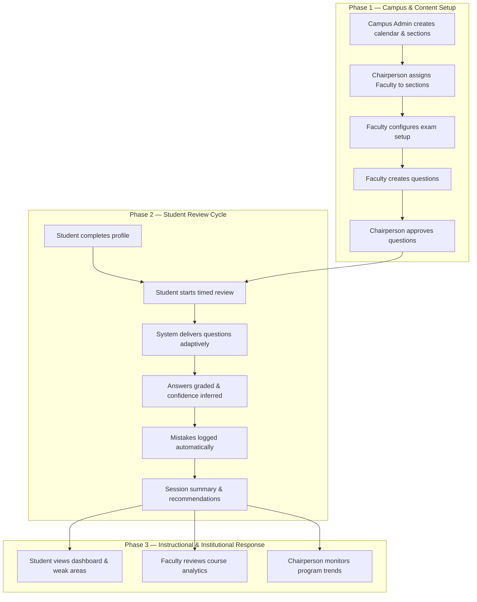
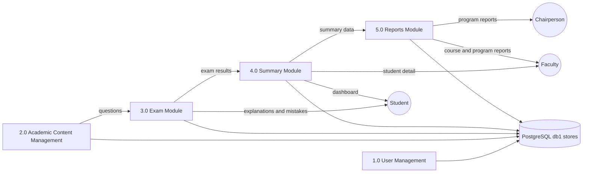
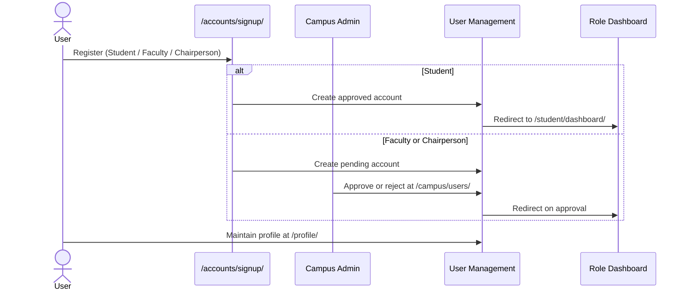
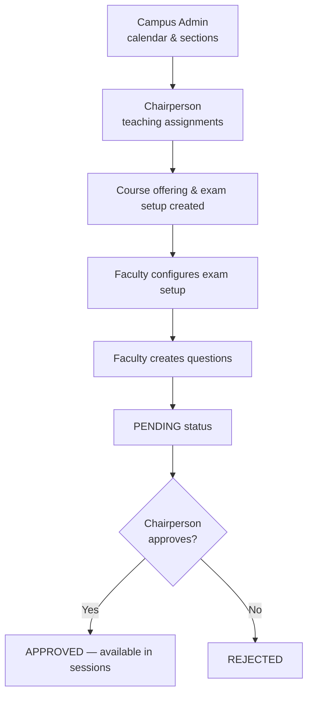
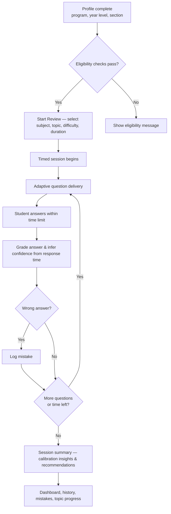
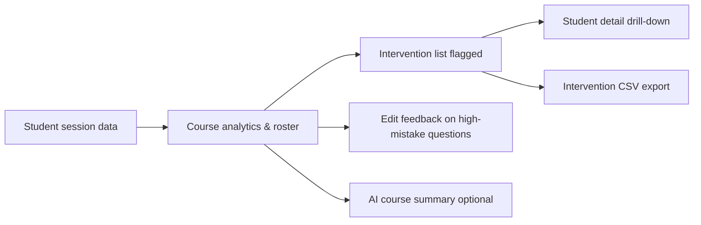
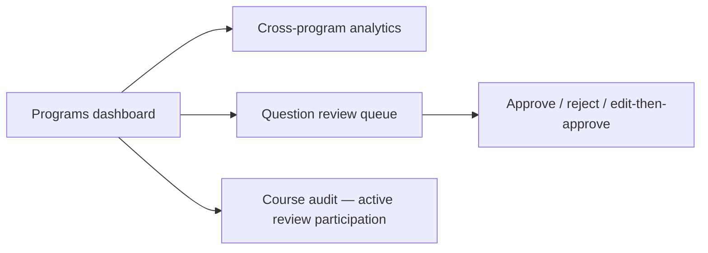
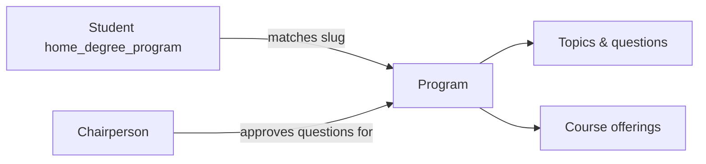

# ExamiQ System Flow

ExamiQ is a self-regulated mathematics exam review system for college students. It combines timed review sessions, confidence-based test flow, explanatory feedback, mistake tracking, and role-based analytics for Faculty and department leadership.

This document describes how users, modules, and data move through the system from setup to review to reporting.

---

## 1. System overview

### External actors

| Actor | Role in the system |
|-------|-------------------|
| **Student** | Completes timed review sessions, views feedback, tracks mistakes and progress |
| **Faculty** | Configures exams, manages the question bank, monitors course performance |
| **Chairperson** | Assigns teaching load, approves questions, monitors program-level trends |
| **Campus Administrator** | Approves accounts, manages academic calendar and program sections |

### Core modules

| Module | Purpose |
|--------|---------|
| **1.0 User Management** | Registration, authentication, profiles, account approval |
| **2.0 Academic Content Management** | Curriculum, subjects, question authoring, distribution |
| **3.0 Exam Module** | Exam setup, timed review, confidence capture, explanatory feedback, AI tutor, mistake logging |
| **4.0 Summary Module** | Dashboards, session history, performance analytics for students and faculty |
| **5.0 Reports Module** | Organized reports for faculty and chairperson based on exam results and learning progress |

DFD diagrams for these modules are in [`docs/dfd/`](dfd/README.md). Mermaid source code is in [`docs/dfd/dfd-mermaid.md`](dfd/dfd-mermaid.md).

---

## 2. High-level system flow



---

## 3. Module interaction flow

During an active review session, modules interact in this order:



---

## 4. End-to-end flows by phase

### Flow A — Account lifecycle



| Step | Action |
|------|--------|
| 1 | User visits the landing page and signs up at `/accounts/signup/` |
| 2 | Student accounts are activated immediately; Faculty and Chairperson accounts enter **pending** status |
| 3 | Campus Administrator reviews pending registrations at `/campus/users/` |
| 4 | Approved user logs in and is redirected to their role home page |
| 5 | All users maintain profile and notifications at `/profile/` |

**Post-login destinations**

| Role | Home URL |
|------|----------|
| Student | `/student/dashboard/` |
| Faculty | `/professor/courses/` |
| Chairperson | `/chairperson/dashboard/` |
| Campus Administrator | `/admin/` or `/campus/` |

---

### Flow B — Content and access pipeline



| Step | Actor | Action |
|------|-------|--------|
| 1 | Campus Administrator | Creates academic years, terms, and program sections; sets current term |
| 2 | Chairperson | Creates teaching assignments (Faculty + section + subject + term) |
| 3 | System | Creates course offering and exam setup for each assignment |
| 4 | Faculty | Enables exam setup — topics, difficulties, duration, per-question timer |
| 5 | Faculty | Creates questions manually or with AI assistance |
| 6 | System | All new questions enter **PENDING** status |
| 7 | Chairperson | Reviews and approves or rejects questions |
| 8 | System | Approved, active questions enter the student review pool |

**Question lifecycle**

```
Faculty creates question
        │
        ▼
     PENDING ──── Chairperson rejects ────► REJECTED
        │
        ▼
  Chairperson approves
        │
        ▼
     APPROVED (active in sessions)
```

If Faculty edits an approved question, it returns to **PENDING** and must be re-approved. Faculty can deactivate questions at any time to remove them from the active pool.

---

### Flow C — Student review cycle



**Eligibility requirements** (checked before a session can start):

- Student profile has section and year level set
- Year level matches assigned section
- A current academic term is active
- At least one teaching assignment exists for the student's section with exam setup enabled by Faculty

**During the exam**

- Countdown timer with per-question time limit
- Questions selected adaptively (prior mistakes, high-confidence wrong answers, unseen items)
- Explanations are **not** shown during the exam — they appear on the session summary afterward

**After the exam**

- Session summary at `/student/review/<id>/summary/`
- Accuracy, calibration insights (mastery, misconception, lucky guess, expected gap)
- Data feeds Dashboard, Session History, Mistakes, Weak Areas, and Topic Progress

---

### Flow D — Instructional response (Faculty)



| Step | Action |
|------|--------|
| 1 | Faculty opens course analytics or roster |
| 2 | System flags students on the intervention list (accuracy, calibration gaps, practice frequency) |
| 3 | Faculty drills into individual student performance |
| 4 | Faculty exports intervention CSV for follow-up |
| 5 | Faculty edits explanations on commonly missed questions |
| 6 | Faculty may generate an AI course summary for reporting |

---

### Flow E — Institutional oversight (Chairperson)



| Step | Action |
|------|--------|
| 1 | Chairperson views Programs dashboard for department-wide performance |
| 2 | Chairperson monitors pending questions and approves or rejects submissions |
| 3 | Chairperson reviews cross-program analytics by home degree program |
| 4 | Chairperson audits which courses have active student review participation |

---

## 5. Role workflow summary

### Student

1. Set **home degree program**, year level, and section in Profile
2. **Start Review** — offerings filtered to the student's program and section
3. Select topic, difficulty, and duration
4. Complete timed session with confidence-inferred answers
5. Review session summary, mistakes, weak areas, and topic progress

### Faculty

| Action | URL |
|--------|-----|
| Overview | `/professor/overview/` |
| My Courses | `/professor/courses/` |
| Course analytics | `/professor/courses/<id>/` |
| Exam setup | `/professor/courses/<id>/exam-setup/` |
| Question bank | `/professor/courses/<id>/questions/` |
| Feedback editing | `/professor/courses/<id>/feedback/` |

### Chairperson

| Action | URL |
|--------|-----|
| Programs dashboard | `/chairperson/dashboard/` |
| Question review | Chairperson question review views |
| Cross-program analytics | Department-scoped program analytics |
| Teaching assignments | Create assignments linking Faculty, section, subject, term |

### Campus Administrator

| Action | URL |
|--------|-----|
| User approval | `/campus/users/` |
| Program sections | `/campus/sections/` |
| Academic calendar | `/campus/academic-calendar/` |
| Campus dashboard | `/campus/` |

---

## 6. Program scoping

Content is organized by **degree program**. Each of the eight programs owns its own math subjects, topics, and question bank.

| Slug | Program |
|------|---------|
| `cs` | Computer Science |
| `it` | Information Technology |
| `bsed_math` | BSEd Mathematics |
| `psychology` | Psychology |
| `marketing` | Marketing |
| `hr` | Human Resources |
| `hospitality` | Hospitality Management |
| `criminology` | Criminology |



---

## 7. Data persistence map

| Data | Primary module | Store |
|------|----------------|-------|
| User profiles & auth | 1.0 User Management | `examiq_db/Users` |
| Questions & curriculum | 2.0 Academic Content Management | `examiq_db/Questions` |
| Review sessions, feedback, mistakes | 3.0 Exam Module | `examiq_db/Sessions`, `Feedback`, `Mistakes` |
| Performance analytics | 4.0 Summary Module | `examiq_db/Analytics` |
| Formal reports | 5.0 Reports Module | `examiq_db/Analytics` (read) |

All modules read and write directly to the `db1` PostgreSQL data stores shown in the DFD set.

---

## 8. Related documentation

| Document | Description |
|----------|-------------|
| [`docs/functional-testing.md`](functional-testing.md) | Functional test cases and module checklist (Appendix A–C) |
| [`docs/functional-testing.pdf`](functional-testing.pdf) | PDF export of functional testing and test cases |
| [`docs/dfd/README.md`](dfd/README.md) | Data Flow Diagrams (Level 1 and Level 2.1–2.5) |
| [`docs/user-guide.txt`](user-guide.txt) | Full user guide with navigation and permissions |
| [`docs/user-roles-and-workflows.md`](user-roles-and-workflows.md) | Role permissions and domain model reference |
