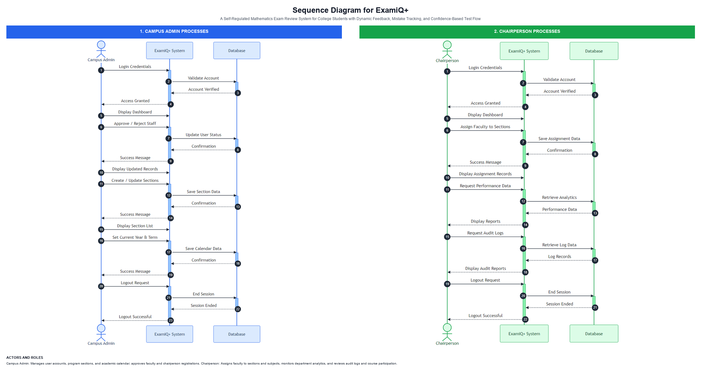
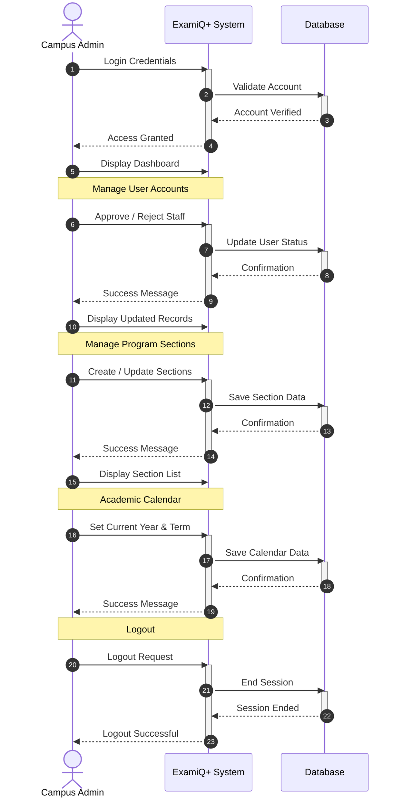
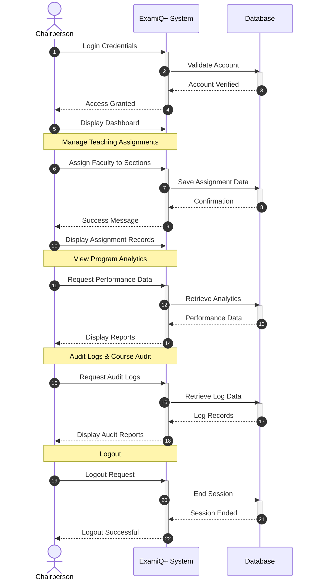
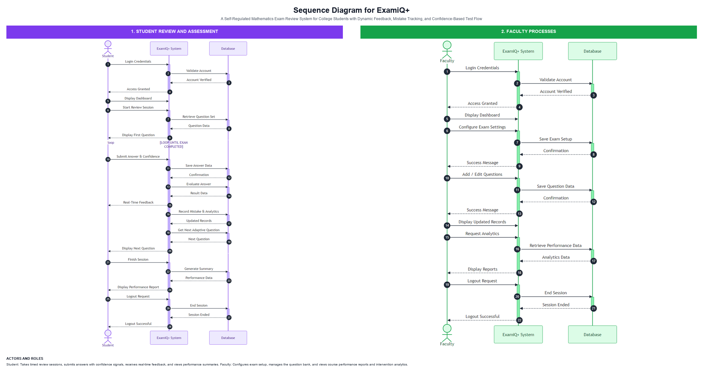
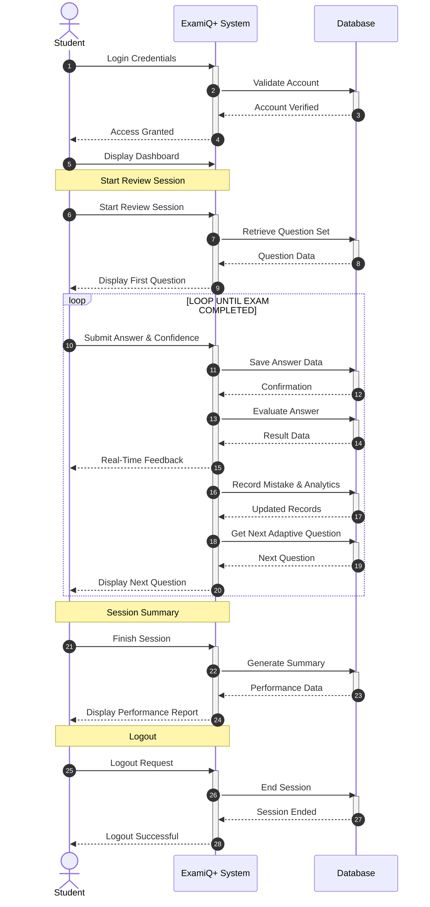
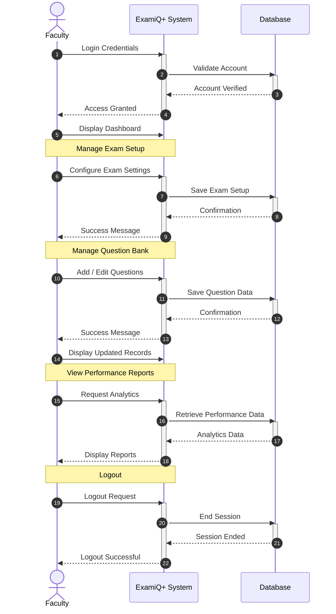

# ExamiQ Sequence Diagrams (Landscape)

Two landscape sequence diagrams: **two independent panels side-by-side** with a gap, colored headers, and role descriptions (no legend, no panel borders).

## Files

| File | Description |
|------|-------------|
| `sequence-diagram-admin-chairperson.png` | Campus Admin \| Chairperson (landscape) |
| `sequence-diagram-student-faculty.png` | Student \| Faculty (landscape) |
| `panels/campus-admin.mmd` | Campus Admin panel source |
| `panels/chairperson.mmd` | Chairperson panel source |
| `panels/student.mmd` | Student panel source |
| `panels/faculty.mmd` | Faculty panel source |
| `../../scripts/generate_sequence_diagrams.py` | Renders panels and composites landscape PNGs |

Regenerate:

```bash
python scripts/generate_sequence_diagrams.py
```

---

## Diagram 1 — Campus Admin | Chairperson



### Panel 1 — Campus Admin (blue)



### Panel 2 — Chairperson (green)



---

## Diagram 2 — Student | Faculty



### Panel 1 — Student (purple)



### Panel 2 — Faculty (green)


