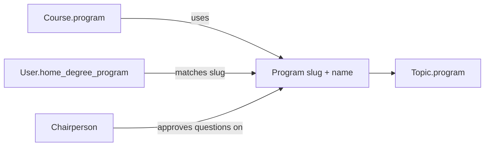

# User Roles and Workflows (ExamiQ v3)

ExamiQ is a **math-only** review platform. Content is organized by **degree program** — each of the eight programs owns its own math topics and question bank. There is no shared "General Education Math" pool.

Students' **home degree programs** (CS, IT, BSEd Math, Psychology, Marketing, HR, Hospitality Management, Criminology) scope which course offerings appear in review setup and feed department-level analytics for chairpersons.

## Domain model

| Entity | Examples | Who manages |
|--------|----------|-------------|
| **Program** | CS, IT, BSEd Math, Psychology, … | Chairperson of program's managing department |
| **Course offering** | MATH101-CS, 1st Sem 2026 | Professor (creates/clones/archives) |
| **Topics & questions** | Discrete Math, Business Math, … | Per program; professor proposes, chair approves |

### Eight programs

| Slug | Program |
|------|---------|
| `cs` | Computer Science |
| `it` | Information Technology |
| `bsed_math` | BSEd Mathematics |
| `psychology` | Psychology |
| `marketing` | Marketing |
| `hr` | Human Resources |
| `hospitality` | Hospitality Management |
| `criminology` | Criminology |

---

## Student workflow

1. Set **home degree program** in Profile (required for review setup).
2. **Start Review** — course offerings filtered to the student's program.
3. Pick **topic** from that program's math subjects, difficulty, and duration.
4. Complete timed session with confidence-rated answers and step-by-step feedback.

---

## Professor workflow

| Action | URL | Notes |
|--------|-----|-------|
| List / create | `/professor/courses/` | Term, year, section, **program** |
| Course analytics | `/professor/courses/<id>/` | Roster from session participation |
| Question bank | per course | Submissions go **pending** until chair approval |

---

## Chairperson workflow

- **Programs** — `/chairperson/dashboard/` — per-program math performance in department scope
- **Question Review** — approve/reject professor submissions
- **Cross-Program** — analytics by home degree program within department
- **Course Audit** — offerings used by department students

Question approval is limited to chairs whose department **manages** the program.

---

## Role permissions summary

| Role | Can | Cannot |
|------|-----|--------|
| **Student** | Review within home program offerings | Access other programs' offerings |
| **Professor** | Own course offerings, propose questions | Approve own questions |
| **Chairperson** | Dept analytics, program approval (if managing dept), course audit | Other departments' student data |
